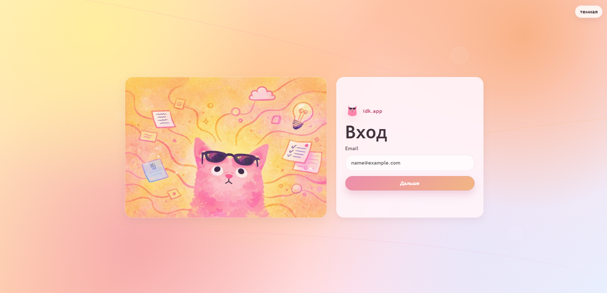
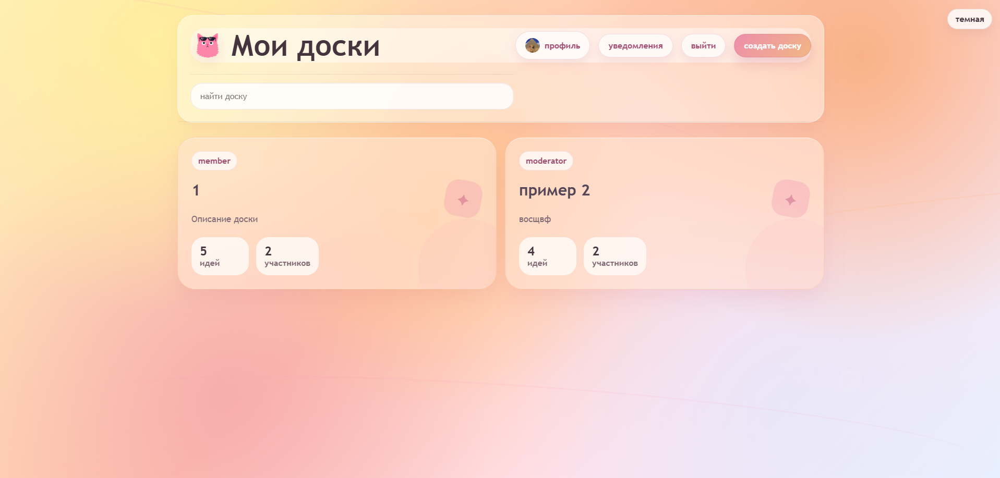
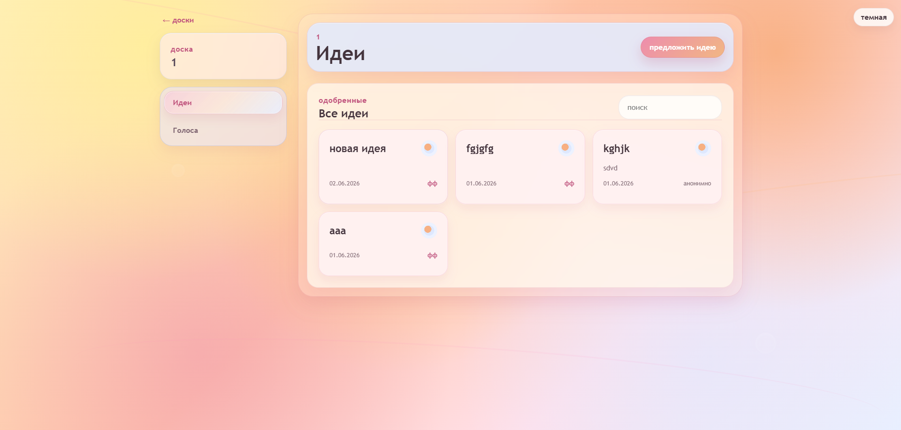
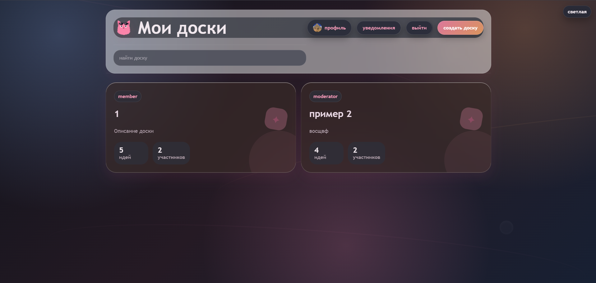
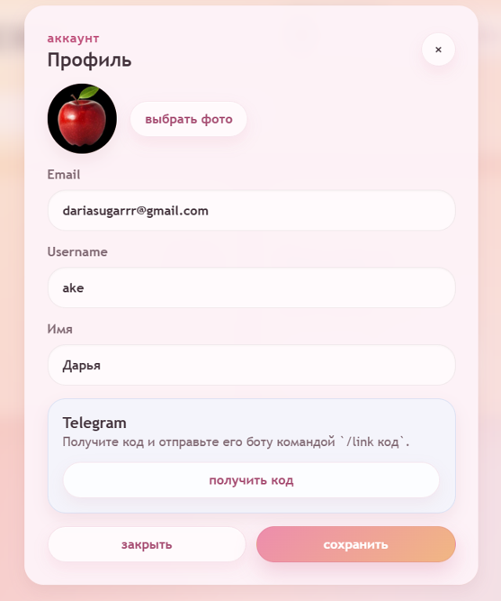
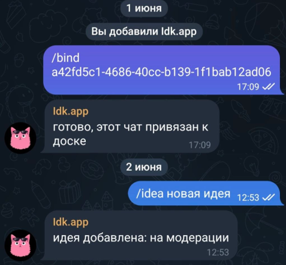
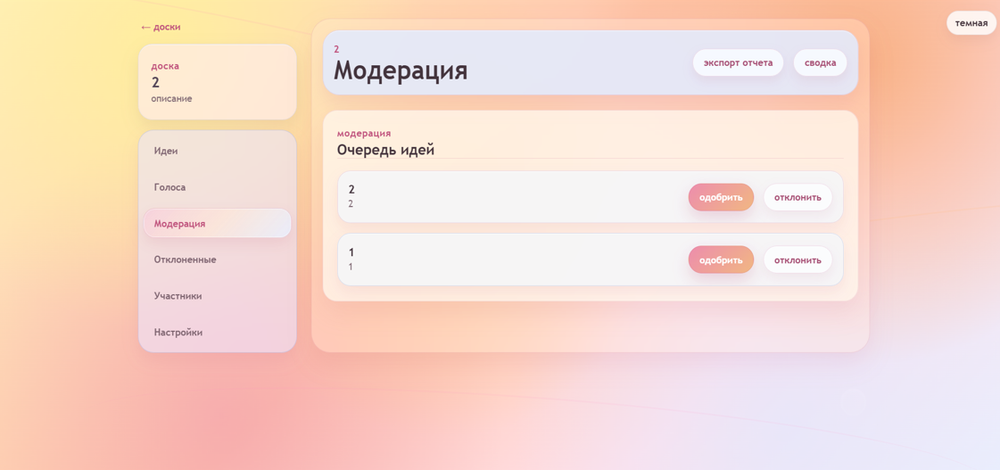
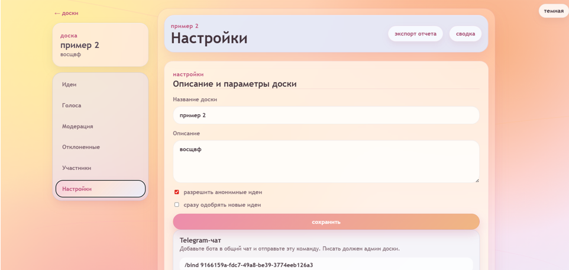
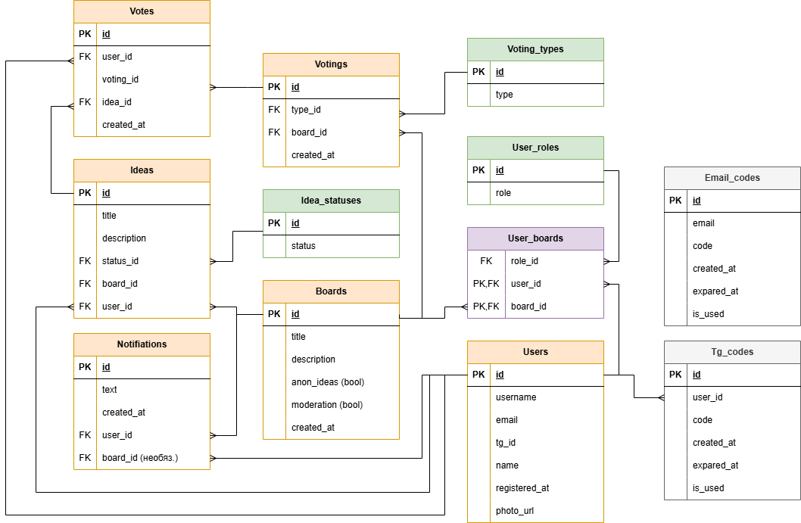
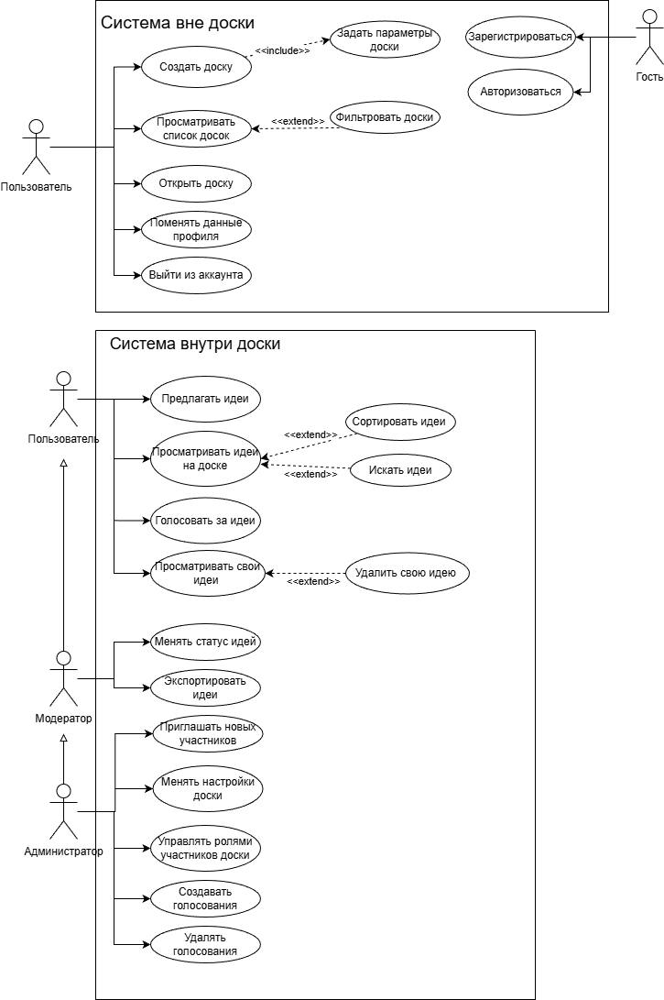

# idk.app

> Веб-приложение для командного брейншторма: доски, идеи, модерация, голосования, уведомления и Telegram-бот в одном месте

> 
- Vue
- Vite
- FastAPI
- PostgreSQL 
- Docker

`idk.app` помогает командам собирать идеи, модерировать предложения, запускать голосования и сохранять лучшие варианты в отчёт. Идеи можно добавлять как через веб-интерфейс, так и прямо из Telegram чата.

## Screenshots


| Авторизация                          | Список досок                  |
|--------------------------------------|-------------------------------|
| |  |

| Доска с идеями               | Тёмная тема                       |
|------------------------------|-----------------------------------|
|        |       |

| Telegram-интеграция                                 | Окна                                                                           |
|-----------------------------------------------------|--------------------------------------------------------------------------------|
|   | |

## Возможности

- Регистрация и вход по email коду.
- Создание досок для брейншторма.
- Добавление, поиск и просмотр идей.
- Модерация идей перед публикацией (если эта опция включена).
- Просмотр отклонённых идей.
- Роли участников: пользователь, модератор, администратор.
- Управление участниками доски.
- Голосования по идеям и просмотр результатов.
- Уведомления о событиях на досках.
- Профиль пользователя и привязка Telegram-аккаунта.
- Добавление идей через Telegram-бота.
- Экспорт отобранных идей в HTML-отчёт.

## Стек

```text
Frontend: Vue 3, Vite, JavaScript, HTML, CSS, qrcode, Vitest
Backend: Python, FastAPI, Uvicorn, SQLAlchemy, Pydantic, JWT, pytest
Database: PostgreSQL 16
Integrations: Telegram Bot API, aiogram, httpx, SMTP Mail.ru
Infrastructure: Docker, Docker Compose
```


Сервисы запускаются через Docker Compose: `frontend`, `backend`, `db` и опциональный `telegram-bot`.

## Быстрый старт

Пример переменных окружения:

```powershell
copy server\.env.example server\.env
```

Запуск приложения:

```powershell
docker compose up -d --build
```

После запуска:

```text
Frontend: http://localhost:5173
Backend API: http://localhost:8000
Swagger: http://localhost:8000/docs
Healthcheck: http://localhost:8000/api/v1/health/
```

Остановить контейнеры:

```powershell
docker compose down
```

## Telegram-бот

Бот нужен, чтобы участники могли добавлять идеи прямо из Telegram-чата.

Запуск вместе с приложением:

```powershell
docker compose --profile bot up -d --build
```

Сценарий работы:

1. Пользователь получает код привязки в профиле.
2. Отправляет боту команду `/link код`.
3. Администратор добавляет бота в чат и выполняет `/bind id_доски`.
4. Участники отправляют идеи командой `/idea текст идеи`.
5. Идея попадает на доску или отправляется на модерацию.

## Переменные окружения

Основной пример лежит в [server/.env.example](server/.env.example).

Ключевые параметры:

```env
DB_HOST=localhost
DB_PORT=5432
DB_USER=postgres
DB_PASSWORD=postgres
DB_NAME=idk_app

SECRET_KEY=change_me
API_URL=http://127.0.0.1:8000

TELEGRAM_BOT_TOKEN=
TELEGRAM_BOT_SECRET=change_me

MAIL_USERNAME=
MAIL_KEY=
MAIL_FROM=
SMTP_HOST=smtp.mail.ru
SMTP_PORT=465
```

## Локальная разработка

Backend:

```powershell
cd server
pip install -r requirements.txt
uvicorn app.main:app --reload
```

Frontend:

```powershell
cd client
npm install
npm run dev
```

## Тестирование

Backend:

```powershell
python -m pytest server/tests
```

Frontend:

```powershell
cd client
npm run test
```

## Структура проекта

```text
client/             frontend-приложение на Vue 3
server/             backend-приложение на FastAPI
server/app/api/     HTTP API и WebSocket endpoints
server/app/db/      модели, сессия и запросы к базе
server/app/services бизнес-логика приложения
server/app/bot/     Telegram-бот
docker-compose.yml  запуск сервисов
```

## DB



## Use Case

